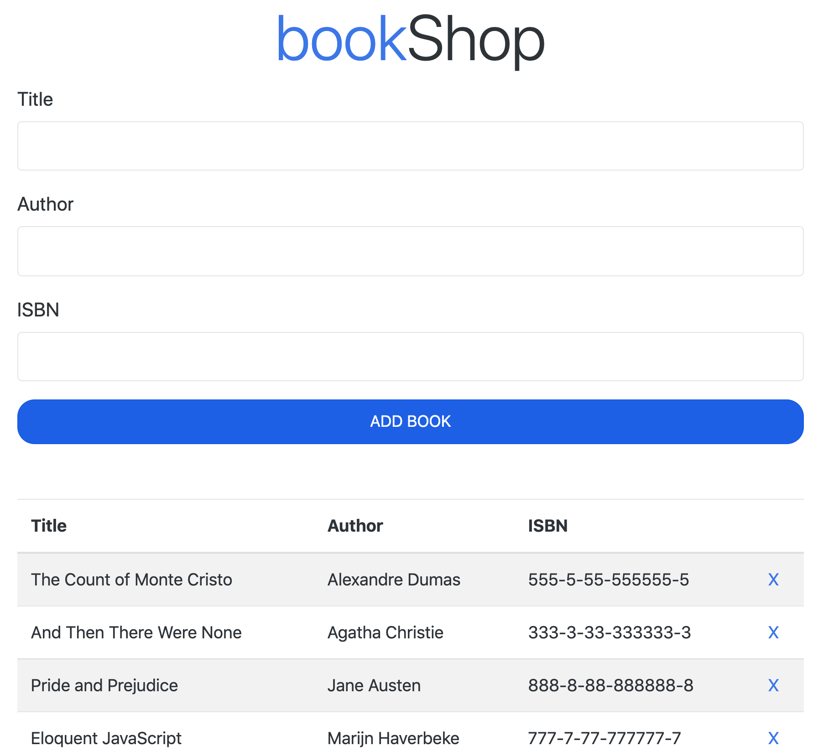

# JavaScript ES5 vs ES6:
I initially made this project using JavaScript ES5 syntax. Then I converted it into a ES6 version using 'class' and 'arrow functions' (Both versions are on the repository).

Afterwards, I added the local storage to the ES6 version, so that the list of books is persistant even after closing or refreshing the browser.

# How to set up the Book Tracker App on your computer:
1. Download the repository's ZIP file and unzip it.
2. Go inside the 'public' folder and open 'index.html' with your browser.

# Book Tracker App
